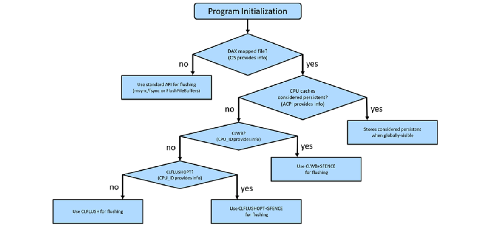

# Persistent-Memory sample code using libpmem
Simple introduction to the libpmem library for perisistent memory (PM) programming. Summarized manual pages intended to strengthen my understanding as well for anyone interested.
Although the library provides low-level support for persistent memory, it is still usable without PM devices. 
For use with PM devices, applications need to use direct access storage (DAX), which enables direct access to files stores, directly mapping virtual addresses to physical addresses and thus bypassing page caches.
 
## Open PM file
```c
void *pmem_map_file(const char *path, size_t len, int flags, mode_t mode, size_t *mapped_lenp, int *is_pmemp);
```
Opens persistent memory file. If not a PM file, it will memory map a traditional file.

- __path__: Path to PM file
- __len__: Size of mapped region, it will be extended or truncated to PM_LEN if file exists.
- __flags__: one key one being PMEM_FILE_CREATE, Flag to create a file if PATH doesn't point to one, if specified, PM_LEN must be a non-zero value and mode must be specified
- __mapped_lenp__, Upon successful mapping, will store the size of the mapped file 
- __is_pmem__ upon successful mapping will store whether the mapped region is persistent memory or not
- Returns pointer to start of memory mapped region upon success

## Persisting Changes
### Flush and drain instructions
For backround, it would be handy to be familiarized with the Intel lower level instructions that will be used to persist data to PM. All of the above instructions are executable in user space which makes them efficient by not requiring these instructions to go into the kernel.


```asm
CLFLUSH
CLFLUSHOPT
CLWB
SFENCE
```
- __CLFLUSH__ flushes a single cache line from all cache hierarchy level. Will also invalidate (should no longer be used by the processor, re-fetch if needed) that cache line from every level. It is a serialized instruction, multiple __CLFLUSH__ instructions will execute one after the other without concurrency. Note: __CLFLUSH__ was introduced before the introduction of PM, so it did not have PM in mind when being developed unlike __CLFLUSHOPT__ and __CLWB__.
- __CLFLUSHOPT__ newly introduced for PM support. It is the same as __CLFLUSH__ but without the serialization. When flushing a range, a __CLFLUSHOPT__ is called for each 64-bit cache line followed by a single __SFENCE__ instruction. Since it is not serialized and optimized, back-to-back __CLFLUSHOPT__ instructions can execute concurrently implicitly.
- __CLWB__ The same as __CLFLUSHOPT__ but won't force the cache to throw away the cache line. This allows the speedup of future reads and writes by increasing the chance of cache hits on the same cache line.
- __SFENCE__ is a serializing instruction to ensure all flushes (or any store to memory instructions) are completed and can be globally visible before continuing. 



This flowchart will show the recommended instructions to use and where to find 
information.

The libpmem library makes our lives easier at is knows the correct arguments for OS calls such as mapping a file. For example, on Linux, it isn't safe to flush changes to PM if the mapping wasn't created with the MAP_SYNC flag. It can also detect if the mapped file is persistent memory and whether or not direct CPU flushing instructions are safe or not. It will detect availible CPU instructions and thus, do most of the work of the flowchart above and any other possible optimizations.

### pmem_flush() & pmem_drain
There are 2 key steps to flush data to persistence:
1. Flush the CPU caches
2. Wait for hardware buffers to drain, ensuring the writes have reached the perisistent media
```c
void pmem_flush(const void *addr, size_t len);
void pmem_drain(void);
```
The are lower level functions that provide access to the individual stages of flushing for more control. Note that either of theses functions can be unnecessary on a given platform and the library once again does the work of checking what is necessary and optimal to do. For example,  __pmem_drain__ is an empty function on Intel platforms.
- __pmem_flush__ will flush data from CPU caches to PM memory controller from user space, no need to call into the kernel if possible. As mentioned above, the best availible store instruction(s) will be used.
 - __pmem_drain__ will ensure all flushes are completed before continuing.


### pmem_persist()
```c
void pmem_persist(const void *addr, size_t len);
```
Tradionally, __msync__ system call was used to syncronize changes to a memory mapped file to guarentee the changes are made to the file before __munmap__ was called.
__pmem_persist__ will force any changes within the passed range of addresses to be stored to PM. Same as calling __msync__ but avoids going into kernel space when possible. it is functionally equivalent to a __pmem_flush__ followed by a __pmem_drain__ and as mentioned before, either of these steps may not be necessary on a given platform. 

### pmem_msync()
```c
int pmem_msync(const void *addr, size_t len);
```
__pmem_msync__ is the same as __pmem_persist__ but will also work on any traditional storage. Will make call to __msync__ system call and take necessary steps to ensure values passed in will meet conditions for __msync__.


## Copying Data to PM

```c
void *pmem_memmove(void *pmemdest, const void *src, size_t len, unsigned flags);
void *pmem_memcpy(void *pmemdest, const void *src, size_t len, unsigned flags);
void *pmem_memset(void *pmemdest, int c, size_t len, unsigned flags);
```
The above functions optimized for PM copying and are functionally equivalent to __memmove__, __memcpy__, and __memset__ with a __pmem_persist__ after. Can be passed flags to ensure more control over which store instruction is used. Ensures changes are flushed unless __PMEM_F_MEM_NOFLUSH__ flag is specified. The __PMEM_F_MEM_NODRAIN__ flag will not do the final __pmem_drain__ step to allow for cases where multiple ranges are copied and flushed, then to perform only a single call to __pmem_drain__.